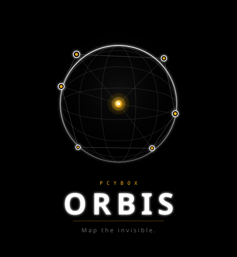
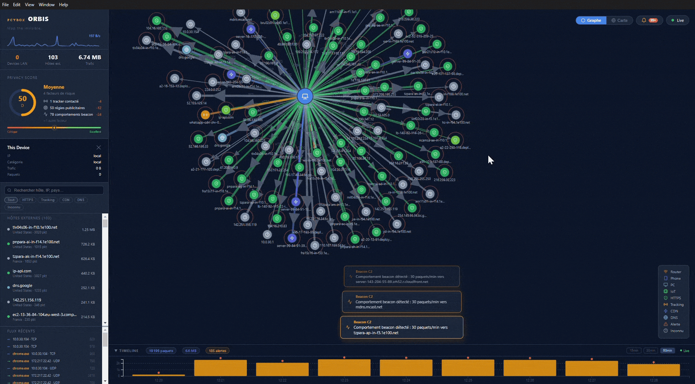

<div align="center">



# PCYBOX Orbis

**Map the invisible.**

Real-time network traffic visualizer for Windows.
See every connection your computer makes - who it talks to, where they are, and which app is responsible.

[](LICENSE)
[]()
[]()

[Website](https://orbis.pcybox.com) - [Download](https://github.com/Mister-iks/pcybox-orbis/releases/latest) - [Report a bug](https://github.com/Mister-iks/pcybox-orbis/issues)

<br/>



</div>

---

## Features

| Feature | Description |
|---|---|
| Force Graph | Live node graph - your machine at the center, every connection as a node |
| World Map | Geolocated IPs with animated arcs on an interactive globe |
| 60-min Timeline | Sliding history stored locally in SQLite |
| Anomaly Detection | Flags port scans, beaconing, potential exfiltration |
| Process Attribution | Know which app generates which traffic (top 5 per connection) |
| LAN Scanner | ARP discovery of all devices on your local network |
| Privacy Score | Real-time score of your outgoing traffic exposure |
| Bandwidth Monitor | Live MB/s sparkline |

## Download

**[PCYBOX Orbis Setup 1.0.0.exe](https://github.com/Mister-iks/pcybox-orbis/releases/latest)** - Windows 10/11 64-bit - ~101 MB

Requires administrator rights for network capture. Npcap is installed automatically on first launch.

## Stack

| Layer | Technology |
|---|---|
| Packet capture | Python - Scapy - Npcap 1.79 |
| Backend API | FastAPI - WebSockets - SQLite |
| Frontend | React 18 - Vite - D3.js v7 - TopoJSON |
| Desktop wrapper | Electron 28 |
| Geolocation | MaxMind GeoLite2 |

## Docker (Linux)

The Docker deployment is for Linux users who want to run Orbis without installing anything beyond Docker.
Packet capture works via `network_mode: host` — the container sees real host traffic.

> **Note:** Docker Desktop on Mac/Windows runs inside a VM and cannot capture traffic from the Windows/macOS host. Use the Electron installer on those platforms.

```bash
# Clone and enter the repo
git clone https://github.com/Mister-iks/pcybox-orbis
cd pcybox-orbis

# Optional: place your MaxMind GeoLite2-City.mmdb in data/ for offline geolocation
# Without it, the app falls back to ip-api.com (45 req/min, no key needed)
mkdir -p data

# Build and run (requires Docker + root/sudo for raw socket capture)
sudo docker compose up --build
```

Open **http://localhost:8000** in your browser.

To run in the background: `sudo docker compose up -d --build`

Limitations compared to the Electron app:
- Process attribution is limited to container processes (host PIDs not shared by default)
- No LAN scanner on some network configurations

---

## Development

### Requirements

- Python 3.11+
- Node.js 18+
- [Npcap](https://npcap.com/) installed
- Administrator terminal for backend (packet capture)

### Run locally

```bash
# Backend (admin terminal)
cd backend
pip install -r requirements.txt
python run_backend.py
# API available at http://127.0.0.1:8000

# Frontend (separate terminal)
cd frontend
npm install
npm run dev
# UI at http://localhost:5173

# Electron (optional, admin terminal)
cd electron
npm install
set VITE_DEV=1
npx electron .
```

### Build installer

```bash
# 1 - Compile backend (PyInstaller)
cd backend
pip install pyinstaller
pyinstaller backend.spec --distpath ../dist/backend

# 2 - Build frontend
cd frontend
npm run build

# 3 - Build Electron installer
cd electron
npm run build:dir
# Then repack app.asar and run:
# npx electron-builder --win nsis --prepackaged ../dist/installer/win-unpacked
```


## Project structure

```
pcybox-orbis/
- backend/       Python FastAPI + Scapy capture engine
- frontend/      React + D3.js UI
- electron/      Electron wrapper (main.js, splash, preload)
- website/       Official landing page (orbis.pcybox.com)
- docs/          SVG logo variants
- resources/     Npcap installer bundle
- dist/          Compiled output (backend exe, installer)
```

## License

MIT - see [LICENSE](LICENSE)

---

<div align="center">
Built by <a href="https://github.com/Mister-iks">Mister-iks</a> - PCYBOX 2026
</div>
